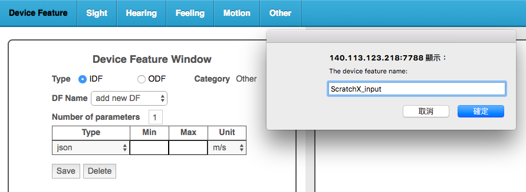
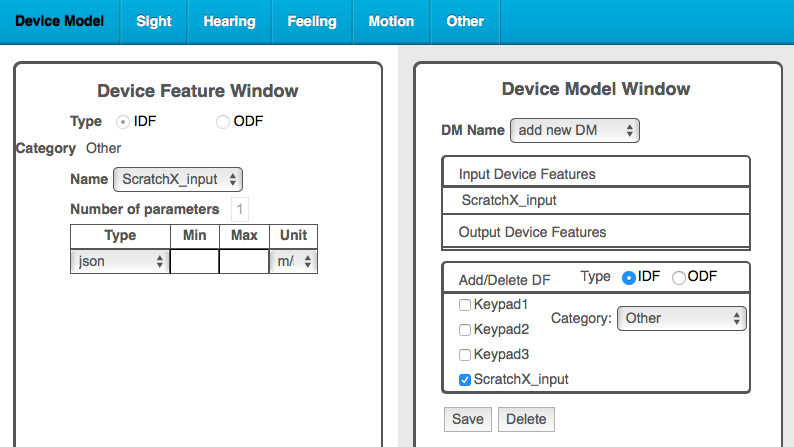
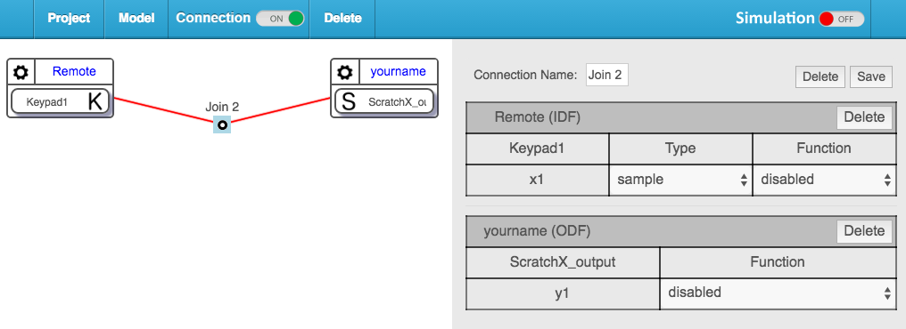
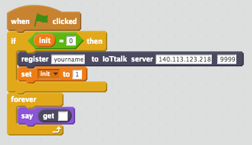
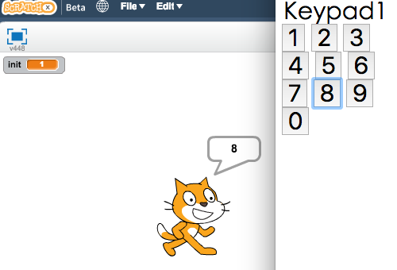
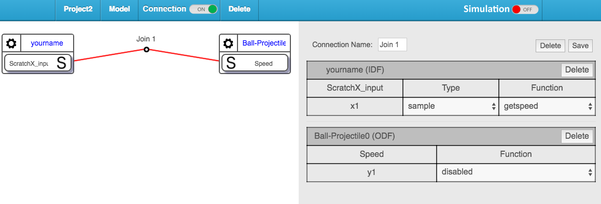
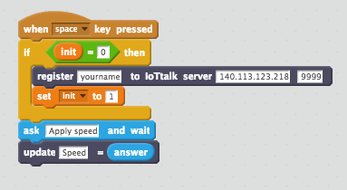
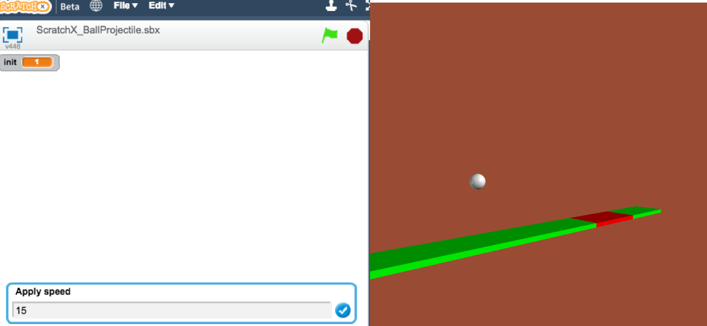

# iottalkDA-scratch document

> Note: not all ScratchX extension are credible  

1. Open [scratchX](http://scratchx.org/)
2. Click `Open Extension URL`
3. paste the extension code's url [https://sunset1995.github.io/snp/extensions/iottalkDA-scratch.js](https://sunset1995.github.io/snp/extensions/iottalkDA-scratch.js)
4. Click `Open`

 
 
## Before start
Make sure IoTtalk server has alread created a module called `ScratchX` with one input feature called `ScratchX_input` and one output feature called `ScratchX_output` on your IoTtalk server.  
Note! The name of the module and feature is really important, please make sure that you don't have typo.  

Follow below steps to create IDF `ScratchX_input`, ODF `ScratchX_output`, DM `ScratchX`:  
1. Add new IDF called `ScratchX_input`, make sure min and max column are blank  
      
2. Add new ODF called `ScratchX_output` like above  
3. Click `Device Feature` button on the left top corner in order to switch to module setting page  
4. Click add new DM  
5. Select `ScratchX_input` and `ScratchX_output` then saved  
      

 
 
## iottalkDA-scratch extension blocks
- 
    - setting IoTtalk server url as `http://ip:port` and registered ScratchX DA with mac address `mac_addr`
    - if not registered, all other blocks will not work

- 
    - detach device on IoTtalk server

- 
    - update your `ScratchX_input` feature to IoTtalk server
    - the `val` will be converted to string type

- 
    - like above one
    - the `val` will be converted to number type

- 
    - get your `ScratchX_output` feature from IoTtalk server
    - if `ScratchX_output` is not an object(dict in python) or array(list in python), the `key` will be ignored and directly get the val of `ScratchX_output`

You can pretend all blocks described above are blocking.

 
 
## Will you flooding http request ??
No, this extension already handle for you.  
More precisely, `update` will only update local *cache*. *cache* will be checked updated or not every **200ms**, issuing `PUT` request only when *cache* updated.  
Also. `get` has a threshold which is **200ms**. Within threshold, you will be given data in *cache* as result.  

 
 
## Examples
### Connect with Keypad
1. Create a project. Join one `Remote_control`'s IDF `Keypad1` and one `ScratchX`'s ODF `ScratchX_output` like below  
    
2. Implement Scratch like below. Note that the key of `get` is blank. In this example, feature `ScratchX_output` is a number, so key of `get` will be ignored  
    
3. Done. Open *iottalk.server:9999/da/panel/* to input value to ScratchX  
    

 
### Connect with Ball-Projectile
<ol>
    <li>
        Create a project like below picture.
         
        
    </li>
    <li>
        The `getspeed` function in above picture  
<pre lang="python3"><code>def run(*args):
    if 'Speed' in args[0]:
        return args[0]['Speed']
    else:
        return 0</code></pre>
    </li>
    <li>
        Implement Scratch
         
        
    </li>
    <li>
        Done. Below is the result after entering 15 in Scratch  
         
        
    </li>
</ol>

 
### Control multiple IDF and ODF
